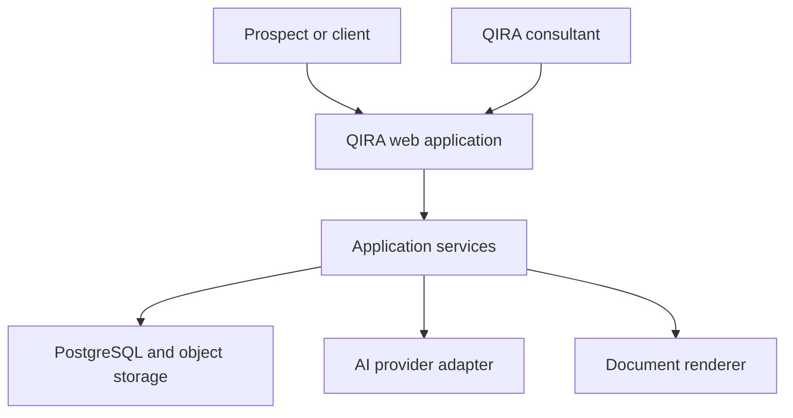
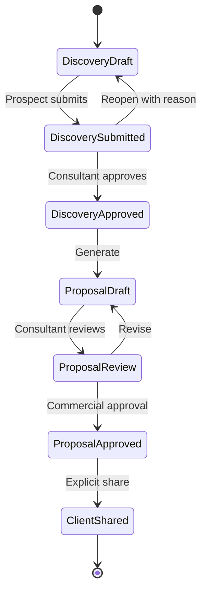
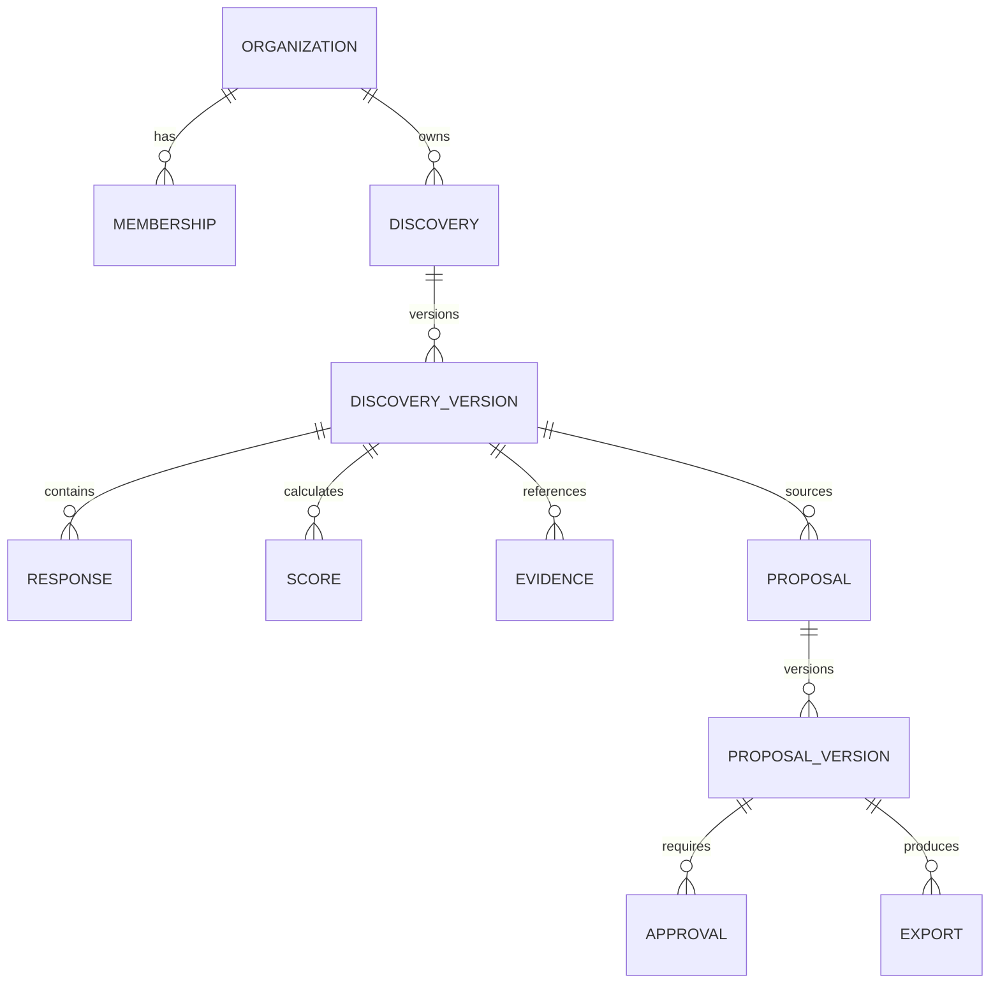

# ARCH-0001 — Discovery to Proposal MVP

**Version:** 1.0.0
**Status:** Accepted
**Related PRDs:** PRD-0001, PRD-0004, PRD-0005, PRD-0006
**Owner:** QIRA
**Last Updated:** 2026-08-03

## Objective

Deliver one secure value stream in which a prospect starts from the Public Platform, completes Discovery, QIRA approves the evidence, a controlled proposal is generated and approved, and the client accesses the approved result.

## Architecture stance

Start as a modular monolith in the existing monorepo. Modules have explicit contracts and tenant-aware authorization, but share one deployable backend until scale, reliability, or team ownership provides evidence for a service split.

## System context



## Product flow



## Repository target

```text
apps/
  public-web/                 Public entry and later authenticated routes
packages/
  domain/                     Entities, state transitions, scoring, policies
  application/                Use cases and ports
  persistence/                Database adapters and tenant-aware repositories
  ai/                         Provider-neutral generation interface
  documents/                  Proposal template and rendering interface
  observability/              Structured logs, metrics, audit writer
docs/
  architecture/              Architecture specifications
  adr/                       Durable architecture decisions
```

The package split is a target introduced only as the corresponding feature is implemented. Empty packages are prohibited.

## Bounded contexts

| Context | Owns | Must not own |
|---|---|---|
| Identity & Organization | User, membership, role, session, invitation | Discovery or proposal content |
| Discovery | Questions, responses, evidence, scoring, submission, approval | Commercial approval or PDF rendering |
| Proposal | Proposal versions, sections, commercial terms, approvals, exports | Discovery mutation |
| Client Access | Share policy and client-visible projection | Internal prompts or unapproved content |
| Audit | Append-only security and business events | Business state transitions |

## Core data model



Every tenant-owned table includes `organization_id`. Repository methods require tenant context; accepting a resource ID alone is prohibited.

## Application contracts

### Discovery handoff

```ts
interface ApprovedDiscoverySnapshot {
  discoveryId: string;
  version: number;
  organizationId: string;
  approvedAt: string;
  approvedBy: string;
  serviceIds: string[];
  businessGoals: string[];
  painPoints: string[];
  desiredOutcomes: string[];
  constraints: string[];
  evidenceReferences: string[];
  scores: Array<{
    type: "opportunity" | "readiness" | "complexity";
    value: number;
    factors: Record<string, number>;
    rulesetVersion: string;
  }>;
  checksum: string;
}
```

### AI generation port

```ts
interface ProposalGenerationRequest {
  discovery: ApprovedDiscoverySnapshot;
  templateVersion: string;
  promptVersion: string;
  locale: "id-ID";
}

interface ProposalGenerationResult {
  sections: Record<string, string>;
  assumptions: string[];
  sourceReferences: Record<string, string[]>;
  provider: string;
  model: string;
  generatedAt: string;
}
```

Provider-specific SDK types must not cross this port.

## Scoring

MVP scores are deterministic and versioned.

- Opportunity considers expected impact, frequency, affected users, urgency, and strategic alignment.
- Readiness considers process clarity, data availability, ownership, sponsor support, and change readiness.
- Complexity considers integrations, data sensitivity, workflow variability, AI uncertainty, and deployment constraints.
- Each score is normalized to 0–100 and stores its factor values and ruleset version.
- Score thresholds are recommendations, never autonomous commercial or delivery decisions.

## Authorization model

Every protected operation evaluates:

`identity → active session → organization membership → role → resource organization → action policy`

Minimum roles:

- `prospect_member`: edit and submit its organization's Discovery.
- `client_viewer`: view explicitly shared client content.
- `client_member`: client viewer plus permitted collaboration actions.
- `qira_consultant`: review assigned Discoveries and proposals.
- `qira_admin`: administrative access with auditable support reason.

UI visibility is not authorization. Policies are enforced server-side and covered by cross-tenant integration tests.

## AI safety and governance

- AI output is always a draft.
- Numeric scoring remains deterministic in the MVP.
- Proposal sharing and export require human approval of the exact version.
- Prompt, template, provider, model, source snapshot, and output version are recorded.
- Sensitive inputs are minimized and redacted before provider calls where feasible.
- Provider failure cannot corrupt approved data; generation can be retried idempotently.
- Production provider and region require an ADR and data-processing review.

## Document security

- Evidence and exports use private storage.
- Downloads use short-lived authorized URLs or streamed server responses.
- File type and size are validated; a malware scanning adapter is required before files become available to reviewers.
- Every upload, view, download, export, and deletion request creates an audit event.
- Retention is configuration-driven and must be confirmed before production launch.

## Audit event minimum

`event_id`, `occurred_at`, `actor_id`, `actor_type`, `organization_id`, `action`, `resource_type`, `resource_id`, `result`, `reason`, `request_id`, and safe metadata.

Secrets, raw prompts containing sensitive data, and document contents must not be written to logs.

## Reliability

- Mutations use idempotency keys where client retries are possible.
- Approved versions are immutable.
- Proposal generation runs as a recoverable job when execution can exceed request limits.
- Database backup and restore tests precede production client data.
- MVP recovery targets: RPO ≤ 24 hours and RTO ≤ 8 hours; tighten after usage evidence.

## Environments

| Environment | Data | AI provider | Purpose |
|---|---|---|---|
| Local | Synthetic only | Ollama or mocked adapter | Development |
| Preview | Synthetic/anonymized | Mock or approved test provider | PR verification |
| Production | Customer data | Approved provider only | Live operation |

Production secrets never enter source control or client-side bundles.

## Delivery slices

### Slice 1 — Domain and identity boundary

- Organization and membership model.
- Tenant context and authorization policy.
- Discovery and proposal state machines.
- Cross-tenant authorization tests.

### Slice 2 — Discovery capture

- Draft/resume, question schema, validation, submission, consent, evidence metadata.
- Deterministic scoring and explanations.
- Consultant review and approved snapshot.

### Slice 3 — Proposal control

- Approved snapshot contract, template/prompt versions, AI adapter, proposal versions.
- Commercial terms, approval state, PDF renderer, checksum.

### Slice 4 — Client sharing

- Invitation, client-visible projection, document authorization, audit history.

### Slice 5 — Production readiness

- Analytics, observability, backup/restore, accessibility, threat model, runbook, and launch checklist.

## Architecture acceptance

- No route or repository can retrieve tenant data without tenant context.
- Approved Discovery and Proposal versions are immutable.
- Provider-specific AI code is isolated behind the generation port.
- Human approval is enforced in the domain layer, not only in UI controls.
- Cross-tenant, state-transition, scoring-reproducibility, and export-integrity tests run in CI.

## Decisions still requiring ADRs

- PDF/DOCX rendering approach.
- Background job mechanism.
- Analytics and consent solution.

Identity, storage, initial AI routing, retention, upload limit, scoring validation, and commercial defaults are accepted in ADR-0002. The precise production AI data region remains a deployment gate.
